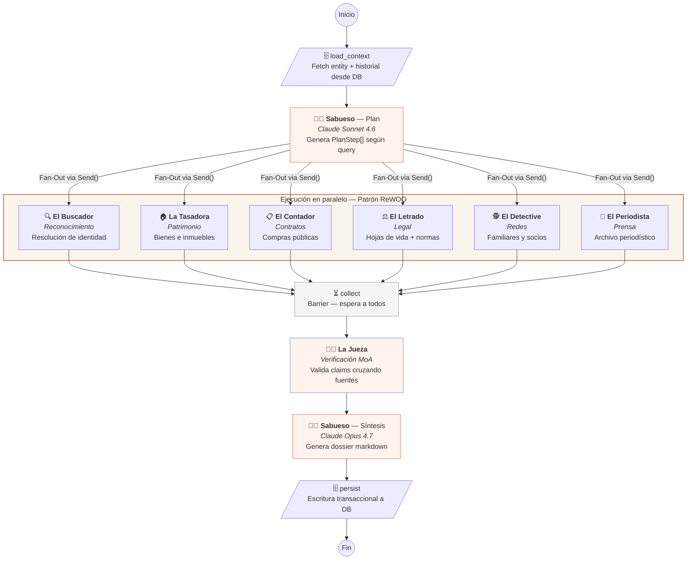
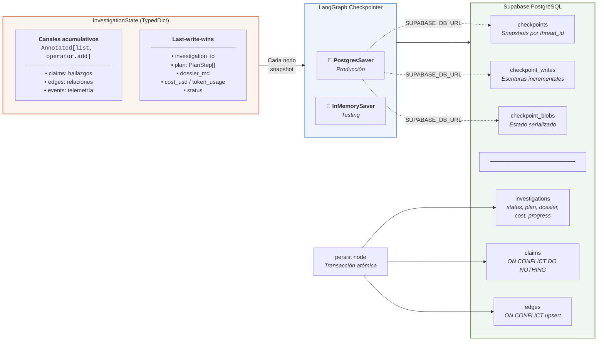

# 🐕‍🦺 Sabueso

> **Sistema multi-agente de investigación periodística para combatir la corrupción en LATAM.**

Sabueso automatiza la auditoría de funcionarios públicos, candidatos y empresas cruzando datos abiertos del Estado (legalización, contratos, patrimonio, registros, prensa) y entregando un *dossier* con evidencia citada y nivel de confianza por hallazgo.

## Stack

| Capa | Tecnología |
|---|---|
| Frontend | Next.js 16 · Vercel AI SDK 6 · AI Elements · cosmos.gl · shadcn/ui |
| Backend | Python 3.12 · FastAPI · LangGraph · Scrapling · CocoIndex |
| LLMs | OpenRouter → Claude Sonnet 4.6 · Kimi K2.6 · DeepSeek V4-Flash · GPT-4o |
| Datos | Supabase Postgres · pgvector · pgmq |
| Infra | GCP Cloud Run · Cloud Storage · Vercel |

## Demo

> 🚧 En construcción — disponible el 17 de mayo 2026

## Arquitectura

Ver `docs/architecture.md` para el modelo C4 completo.

### Orquestación de agentes — LangGraph Hierarchical Fan-Out + Barrier

El orquestador **Sabueso** planifica la investigación y delega en paralelo a 7 investigadores especializados. Cada sub-agente usa el patrón **ReWOO** (Reasoning WithOut Observation) para planificar sus tool-calls antes de ejecutarlas. **La Jueza** aplica verificación **Mixture-of-Agents (MoA)** sobre los hallazgos antes de la síntesis final.



### Persistencia de contexto — LangGraph Checkpointing + Supabase

El estado de investigación (`InvestigationState`) fluye entre nodos usando **canales reductores** de LangGraph. Los campos acumulativos (`claims`, `edges`, `events`) se concatenan automáticamente tras el fan-out paralelo. El checkpointer persiste cada snapshot en PostgreSQL para tolerancia a fallos y reanudación.



### Fuentes de datos — Tool Registry por país

Los agentes acceden a datos gubernamentales abiertos mediante un **registro de herramientas** (`ToolRegistry`) con namespace por país, caché por TTL y rate-limiting por host. Perú es first-class; Chile, México y El Salvador están en preview.

```mermaid
flowchart TB
    subgraph registry ["ToolRegistry — apps/worker/src/tools/"]
        direction TB
        cache["🗃️ Cache por TTL<br/><code>cached_tool_call()</code>"]
        rate["⏱️ Rate Limiter<br/>por hostname"]
    end

    subgraph peru ["🇵🇪 Perú — First-Class"]
        direction TB
        seace["📋 <b>search_seace_contracts</b><br/>OSCE/SEACE — Contratos públicos<br/><i>contratacionesabiertas.osce.gob.pe</i><br/>TTL: 24h · 1 req/s"]
        manolo["🏛️ <b>search_manolo</b><br/>Manolo.pe — Visitas a entidades<br/><i>www.manolo.pe</i><br/>TTL: 24h · 2 req/s"]
        sunarp["🏠 <b>query_sunarp_properties</b><br/>SUNARP — Registro de propiedades<br/><i>www.sunarp.gob.pe</i><br/>TTL: 7d · 1 req/s"]
        jne["🗳️ <b>fetch_jne_hoja_vida</b><br/>JNE — Hojas de vida de candidatos<br/><i>plataformaelectoral.jne.gob.pe</i><br/>TTL: 30d · 1 req/s"]
        peruano["📜 <b>search_el_peruano</b><br/>El Peruano — Diario oficial<br/><i>busquedas.elperuano.pe</i><br/>TTL: 7d · 2 req/s"]
        news["📰 <b>search_news_archive</b><br/>IDL · OjoPúblico · Convoca · Wayback<br/>TTL: 1d · 2 req/s"]
        dni["🪪 <b>find_dni_record</b><br/>RENIEC — Identidad por DNI"]
        ruc["🏢 <b>find_ruc_record</b><br/>SUNAT — Registro tributario RUC"]
    end

    subgraph preview ["Preview — S-18"]
        cl["🇨🇱 Chile"]
        mx["🇲🇽 México"]
        sv["🇸🇻 El Salvador"]
    end

    subgraph agents ["Agentes investigadores"]
        b["🔍 El Buscador"] --> manolo & dni & ruc
        t["🏠 La Tasadora"] --> sunarp
        c["📋 El Contador"] --> seace
        l["⚖️ El Letrado"] --> jne & peruano
        d["🕵️ El Detective"]
        p["📰 El Periodista"] --> news
    end

    registry --> peru & preview
    peru --> cache --> rate

    style peru fill:#f9f5ed,stroke:#DA7756,stroke-width:2px
    style preview fill:#f5f5f5,stroke:#999,stroke-dasharray:5 5
    style registry fill:#eef4fa,stroke:#6A9BCC,stroke-width:2px
    style agents fill:#fef3ed,stroke:#DA7756,stroke-width:1px
```



## Desarrollo

```bash
# Prerrequisitos: Node >= 20, pnpm >= 9, Python >= 3.12, uv, Docker
git clone https://github.com/JosephRobles23/Sabueso
cd sabueso
cp .env.example .env  # Llena las variables
pnpm install          # Frontend + packages
cd apps/api && uv sync   # Backend
cd apps/worker && uv sync
```

## Documentación

- [`docs/architecture.md`](docs/architecture.md) — C4 model
- [`docs/uiux-spec.md`](docs/uiux-spec.md) — Cinema Mode UI spec
- [`docs/linear-tasks.md`](docs/linear-tasks.md) — 20 tasks condensadas

## Licencia

MIT — ver [LICENSE](LICENSE)

---

*Construido en 3 días para [hack@latam 2026](https://hack.indies.la/) con Emdash + Claude + Kimi 🐕‍🦺*
